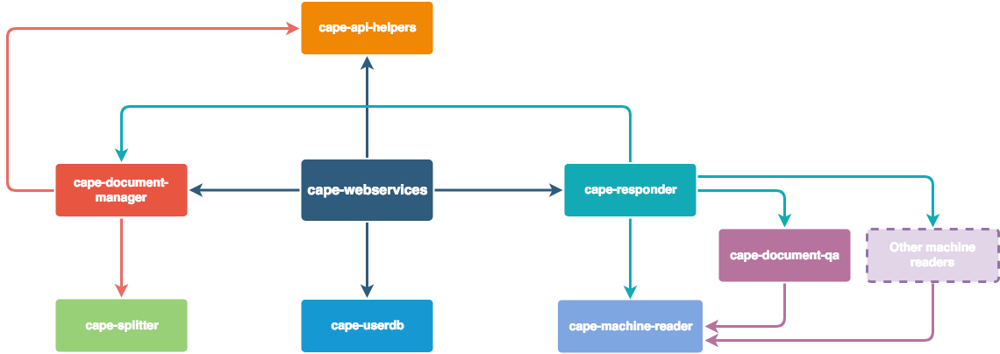

# cape-machine-reader

Cape machine reader provides an interface between machine reading models and the rest of Cape,
and provides powerfully scaling answer decoding functionality for machine readers

## Who is this repo for?

This repo is helpful for those wishing to build and integrate their own machine reading models into Cape.
For low-level access to a Question answering functionality the [MachineReader objects](https://github.com/bloomsburyai/cape-machine-reader/blob/master/cape_machine_reader/cape_machine_reader_core.py),
object can be used, but most users may find the functionality exposed by [cape-responder](https://github.com/bloomsburyai/cape-responder) to be more complete and easy to
work with at a higher level.

## Who is this repo not for?

most users may find the functionality exposed by [cape-responder](https://github.com/bloomsburyai/cape-responder) to be more complete and easy to
work with at a higher level.

## Install:

To install as a site-package:

```
pip install --upgrade --process-dependency-links git+https://github.com/bloomsburyai/cape-document-qa
```

## Usage

ToDo

## Integrating your own model:
 
If you have your own machine reading model and you want to make it compatible with cape, you
need to create a class that implements [cape_machine_reader_model.py](https://github.com/bloomsburyai/cape-machine-reader/blob/master/cape_machine_reader/cape_machine_reader_model.py).

The interface is designed to make as few assumptions about your model as possible, and to be as flexible as possible
whilst allowing performant machine reading. Models that fulfil this interface are wrapped by [MachineReader objects](https://github.com/bloomsburyai/cape-machine-reader/blob/master/cape_machine_reader/cape_machine_reader_core.py),
making them both powerful and useful for production environments.

Models are required to implement 3 simple methods:

### `tokenize`

The tokenize method should implement your model's NON-DESTRUCTIVE tokenization scheme.
Strings should be tokenized into lists of token strings, and a corresponding list of character start and end indices of the tokens.

### `get_document_embedding`

This method should accept a paragraph as a string (about 400-500 words).
Machine reading models embed the context paragraph and the question seperately, and then typically perform attention and project start-logit
scores and end-logit scores. 
This method should return the DEEPEST Question-independent document representation for your model.
This is so that Cape can cache this representation, which enables impressive speedups when multiple questions get
applied to the same document at test time.
The expected return type is a 2d numpy array, of shape (num_tokens, embedding dimension)

### `get_logits`

This method should accept a question as a string, and an embedded document context (generated by `get_document_embedding`), and should return 
two numpy arrays containing LOGIT scores for start and end spans in the document.

## Examples

ML developers could be inspired by [cape-document-qa](https://github.com/bloomsburyai/cape-document-qa) which contains a powerful
open-domain machine reader and implements `CapeMachineReaderModelInterface`.

An even simpler one that we use for testing (simply generates random logit scores) 
can be found here: [cape_machine_reader_model.py](cape_machine_reader/tests/test_machine_reader_model.py).


We are working on other models that have different characteristics (speed/scale/accuracy).

### Telling responder how to load your model

The dependency diagram of Cape is shown below, including a second Machine reading model for clarity.



[cape-responder](https://github.com/bloomsburyai/cape-responder) needs to be told how to load your new model.
Loading your model should be as simple as possible.

The code that imports cape-document-qa into responder is only 2 lines, and can be found [here](https://github.com/bloomsburyai/cape-responder/blob/7fa606ecdae623a2579475d737929d3f2059c1cc/cape_responder/responder_core.py#L44). You
can add your model loading logic adjacent to here to get Cape to use your model architecture.
